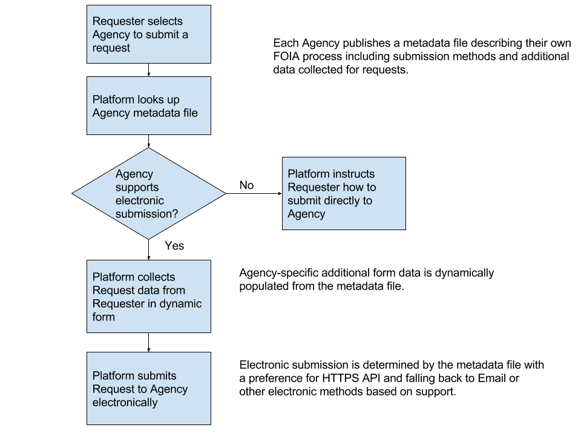

# FOIA Schemas

These are works-in-process as we evaluate opportunities for interoperability
amongst the various existing applications and processes in the FOIA ecosystem.

The first schema describes a means for agencies to describe their existing FOIA
processes and systems.

The second two schemas describe a single request at different points in time. We
delineate two request schemas because there are two distinct perspectives on the
data: one for creating a request, and another for tracking a request. The first
is a subset of the second.


<a name="foia-metadata-json-file"></a>
## Agency metadata file

In order for a national Platform to submit requests to an agency, the
agency must publish an agency metadata file. [Project Open
Data](https://project-open-data.cio.gov/v1.1/schema/) is an example of
a metadata file schema that allows for open government datasets to be
cataloged by third-parties.

The agency metadata file is core to interoperability. It is a machine-readable
(e.g. JSON) file that describes the agency’s existing FOIA process. The national
Portal can read this file in order to understand how to interact with the
agency’s existing process. Instead of defining one standard for how an agency
must accept submissions and burdening agencies who would have to implement that
standard, it allows agencies to continue accepting submissions from the Portal
through their existing methods. It also provides a way for capable agencies to
opt-in to richer submission methods, like through an HTTPS API.


### What information is in the metadata file?

- Agency FOIA contact info
- FOIA resources like reading rooms
- Annually reported statistics for request processing time
- Additional component-specific information to be collected from a requester
- Information that would help a requester make a perfected request
- Request submission methods

Much of this information is already published but not in a way that is useful to
the Portal because it is not machine-readable. Agencies are best positioned to
provide this information. If agencies have control over providing this
information in a machine-readable way, then the information can be maintained
more accurately and updated more quickly than having to proxy this information
through OIP.


### How would the Portal use this information?

- Describe to a requester how to contact the agency
- Describe to a requester other FOIA resources like agency reading rooms
- Give some expectation to how long a request might take based on historical data
- Collect information from the requester that is required for a perfected request
- Negotiate with the requester any additional information while not required,
  may help to narrow or expedite the request
- Submit electronic requests directly into the agency’s case management system (if applicable)
- Or if direct electronic submission is not possible, to email the agency with a perfected request

Even though this information might already be available, it is only useful to
the Portal if it is machine-readable. Having it in a single, standard file makes
it easier to collect this information across agencies and components.

Our research has shown that users often find additional requirements for FOIA
submission confusing and burdensome. We hope that by having agencies include
supplemental information about the requirements, it will help inform requesters
and allay any concerns.

This flow diagram illustrates how the metadata file is used for submission:




### Empower agencies to keep this information up to date

Having agencies responsible for maintaining this metadata file means agencies
are empowered to change it at will, as often as their organization changes, and
immediately when their organization changes. Agencies do not need to coordinate
with an external entity like OIP to get this information published. We believe
this will lead to more accurate information for requesters.

In agency interviews, we offered a few options for maintaining an agency metadata file.

- A **pull** approach where agencies would be responsible for creating their
  metadata file and hosting it at a well known location on their website (e.g.
  `agency.gov/foia.json`) from where it can be pulled.
- A **push** approach where agencies would be responsible for creating their
  metadata file and submitting it to a centralized repository.
- A **GUI** approach where the metadata files would be stored in a centralized
  repository but agencies could update their information through a web form hosted
  at foia.gov using a secure account.

The few agencies we spoke to told us that they would like the third option
(GUI), a website where they can update their metadata file through a web UI
rather than maintain it directly. Some of these agencies described the metadata
file as being too technical. This has the advantage that agency FOIA offices do
not need to coordinate with IT or other agency teams in order to update their
metadata file. FOIA offices don’t need to be an expert in web publishing or JSON
to update their agency’s information.


### Moving towards true interoperability

Many agencies have a custom or manual FOIA process where electronic submission
means receiving a FOIA request by email and manually entering the request data
into the agency’s case management system. For these agencies, we hope that the
Portal will help requesters make better requests but the real benefit eventually
would be to submit these requests directly into the agency’s case management
system without the need for manual data entry.

Even agencies that have a web form for submitting FOIA requests don’t provide an
API for a national Portal to submit requests directly to their case management
system. We’ve defined a draft request schema for what a submission API might
accept but agencies would have to build it. As an intermediate step, we’ve come
up with several options for providing a tiered approach for agencies to accept
richer submissions. We will be collecting feedback from agencies on these
options.

- Plain-text email containing request data
- Email with request data as an attachment in machine readable format e.g. csv, json, xml
- Email with request data in email headers
- HTTPS RESTful API


### Schema

The metadata file should include the following fields:

* agency abbreviation
* list of departments/components
  * name
  * list of submission methods
    * submission format

You can see [example metadata files
here](https://github.com/18F/foia-recommendations/tree/master/examples).

The schema for this metadata file is partially inspired by the [2015 FOIA
work](https://github.com/18F/2015-foia/tree/master/contacts/data) around
collecting contact information.


### Submission methods

A list of methods that the agency supports for receiving a FOIA request. Each
method represents a different format. Example formats include `paper`, `fax`,
`email`, `web` and `api`.


#### Receiving requests from a National Platform

The agency can specify additional information to be collected by the platform by
specifying these optional fields.

  * required form fields
    * name
    * label
    * URL to the regulations requiring additional information
    * help text
  * additional form fields
    * name
    * label
    * help text
  * uiSchema describing form presentation


##### uiSchema for form presentation

In order to present the form to the requester as the agency intends, the agency
can include a limited version of
a [uiSchema](https://github.com/mozilla-services/react-jsonschema-form#the-uischema-object)
that can be used to describe how the additional fields should be rendered.

* ui:order
* field(s)
  * ui:widget
  * ui:placeholder


## Creating a request

Based on the form at
https://foiaonline.regulations.gov/foia/action/public/request/createRequest these minimal fields are required:

* agency name
* requester name
* requester mailing address
* requester will pay up to max processing fee
* description
* fee waiver?
* expedited?

Then these additional, optional fields are present:

* requester organization
* requester email
* requester phone
* requester fax
* attachments

Written as an example SQL schema, this might look like (ignoring any normalization for things like agency, and if files or filepaths are stored in the database):

```sql
 agency_name            | character varying(255)      | not null
 requester_name         | character varying(255)      | not null
 requester_address      | text                        | not null
 max_fee                | money                       | not null default 0.00
 description            | text                        | not null
 fee_waiver             | boolean                     | not null default false
 expedited              | boolean                     | not null default false
 organization           | character varying(255)      |
 email                  | character varying(255)      |
 phone                  | character varying(255)      |
 fax                    | character varying(255)      |
 attachments            | text                        |
```

## Tracking a request

This gets into the realm of case management, for which there are many existing solutions, depending on who is doing the tracking (the requester or the agency). This is the space where things like status and timestamps and metadata *about* the request are important.

So, to extend our example from above, with the same caveats about normalization:

```sql
CREATE TYPE possible_statuses AS ENUM ('new', 'assigned', 'pending', 'closed');
CREATE TYPE possible_submission_types AS ENUM ('paper', 'fax', 'email', 'online_form');

 id                     | integer                     | not null -- internal private id
 reference_id           | uuid                        | not null -- public id
 agency_name            | character varying(255)      | not null
 requester_name         | character varying(255)      | not null
 requester_address      | text                        | not null
 max_fee                | money                       | not null default 0.00
 description            | text                        | not null
 fee_waiver             | boolean                     | not null default false
 expedited              | boolean                     | not null default false
 organization           | character varying(255)      |
 email                  | character varying(255)      |
 phone                  | character varying(255)      |
 fax                    | character varying(255)      |
 attachments            | text                        |
 status                 | possible_statuses           |
 assigned_to            | character varying(255)      |
 submitted_via          | possible_submission_types   |
 date_filed             | timestamp without time zone |
 date_due               | timestamp without time zone |
 date_acknowledged      | timestamp without time zone |
 created_at             | timestamp without time zone | not null -- about the record, not the request
 updated_at             | timestamp without time zone | not null -- about the record, not the request
```

The tracking schema is a superset of the previous one. It contains all the
fields from [creating a request](#creating-a-request) example.
